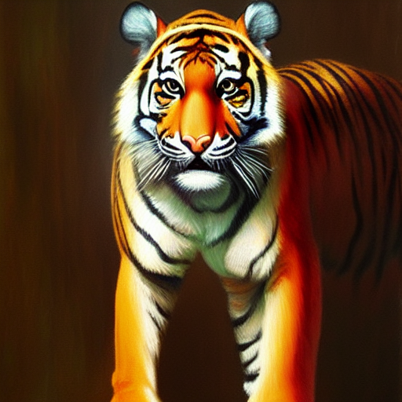
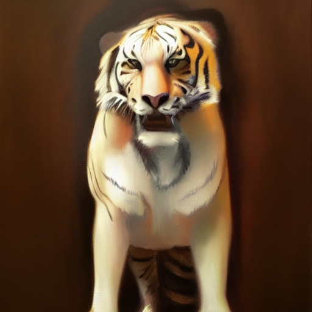
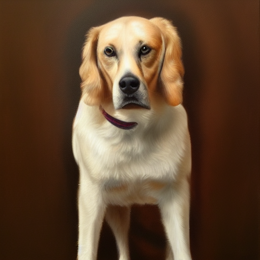

# Prompting techniques

You can modify a keyword’s importance by switching to a different one at a certain sampling step.

The following syntaxes apply to AUTOMATIC1111 WebUI. You can run this WebUI with one-click using the Colab notebook in the [Quick Start Guide](https://github.com/yuyan124/sd_tools/blob/main/sdwebui_paint.ipynb). You can also install it on [Windows](https://stable-diffusion-art.com/install-windows/) and [Mac](https://stable-diffusion-art.com/install-mac/).

### Keyword weight

You can adjust the **weight** of a keyword by the syntax `(keyword: factor)`. `factor` is a value such that less than 1 means less important and larger than 1 means more important.

For example, we can adjust the weight of the keyword `photorealistic` in the following prompt

> best quality, ultra high res, RAW photo, realistic,  (photorealistic:1.4), a girl in blue sweater and grey skirt, dancing on an outdoor stage in a bright sunny day

This technique can be applied to subject keywords and all categories, such as style and lighting.

### () and [] syntax

(*This syntax applies to AUTOMATIC1111 GUI.*)

An equivalent way to adjust keyword strength is to use `()` and `[]`. `(keyword)` increases the strength of the keyword by a factor of 1.1 and is the same as `(keyword:1.1)`. `[keyword]` decrease the strength by a factor of 0.9 and is the same as `(keyword:0.9)`.

You can use multiple of them, just like in Algebra… The effect is multiplicative.

**(keyword): 1.1**
**((keyword)): 1.21**
**(((keyword))): 1.33**

Similarly, the effects of using multiple `[]` are

**[keyword]: 0.9**

**[[keyword]]: 0.81**

**[[[keyword]]]: 0.73**

### Keyword blending

(*This syntax applies to AUTOMATIC1111 GUI.*)

You can mix two keywords. The proper term is **prompt scheduling**. The syntax is

[keyword1 : keyword2: factor]

`factor` controls at which step keyword1 is switched to keyword2. It is a number between 0 and 1.

For example, if I use the prompt: `oil painting , [dog: tiger:0.5]`

for 30 sampling steps. That means the prompt in steps 1 to 15 is ``Oil painting portrait of dog``

And the prompt in steps 16 to 30 becomes ``Oil painting portrait of tiger``

The factor determines when the keyword is changed. it is after 30 steps x 0.5 = 15 steps.

The effect of changing the factor is blending the two animals to different degrees.

 

#### prompt-to-prompt

Using keyword blending, you can achieve effects similar to [prompt-to-prompt](https://prompt-to-prompt.github.io/), generating pairs of highly similar images with edits. The following two images are generated with the same prompt except for a prompt schedule to substitute `peach blossoms` with `chrysanthemums`. The seed and number of steps were kept the same.

 

The factor needs to be carefully adjusted. How does it work? The theory behind this is the overall composition of the image was set by the early [diffusion process](https://stable-diffusion-art.com/how-stable-diffusion-work/#Diffusion_model). Once the diffusion is trapped in a small space, swapping any keywords won’t have a large effect on the overall image. It would only change a small part.